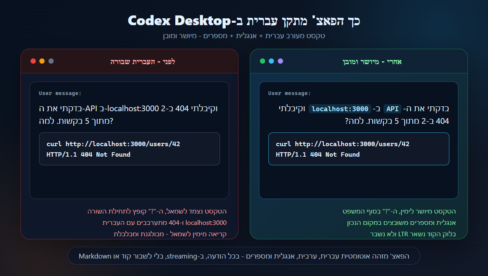

# Codex RTL Patch for Hebrew on Codex Desktop

A drop-in RTL patch for **OpenAI Codex Desktop** that improves Hebrew and
Arabic writing, mixed RTL/LTR text, punctuation alignment, and keeps code
blocks left-to-right.

תיקון RTL ל-OpenAI Codex Desktop שמשפר כתיבה בעברית ובערבית, טקסט מעורב
עברית/אנגלית, יישור סימני פיסוק ושמירה על בלוקי קוד משמאל לימין.

By **RT-AI** - [rt-ai.co.il](https://rt-ai.co.il)

   

---
## Who is this for?

This project is for Hebrew and Arabic users who use OpenAI Codex Desktop and want natural RTL writing inside the app, without changing their original Codex installation.
מיועד למשתמשי עברית וערבית שעובדים עם OpenAI Codex Desktop ורוצים כתיבה טבעית מימין לשמאל בתוך האפליקציה, בלי לשנות את ההתקנה המקורית.

## התקנה - שורה אחת

### Windows

פתחו **PowerShell** (לא חייב admin), הדביקו את השורה הזו, ולחצו Enter:

```powershell
irm https://raw.githubusercontent.com/rt25ai/codex-rtl-rt-ai/v0.1.8/install-online.ps1 | iex
```

זהו. בסוף יופיע קיצור דרך בשם **"Codex"** על שולחן העבודה ובתפריט Start, והוא יפתח
את הגרסה החדשה עם תמיכה ב-RTL.

> **דרישות:** [Node.js (LTS)](https://nodejs.org/) + Codex Desktop מ-Microsoft Store.
> לא נדרשים admin / takeown / שינויי הרשאות.

> **אם Windows מציג אזהרת אבטחה (`Trojan:Win32/ClickFix`):**
> זו **התרעת שווא (false positive)** — לא וירוס. Windows Defender מסמן כך כל
> פקודה מסוג `irm ... | iex` בגלל **צורת ההתקנה**, לא בגלל התוכן (הסיומת `!MTB`
> פירושה ניחוש היוריסטי, לא חתימה של נוזקה ידועה). הסקריפט פתוח לקריאה כאן
> ב-GitHub — הוא רק יוצר **עותק מקומי** של Codex עם תמיכת עברית, בלי לגעת
> בהתקנה המקורית, ב-registry או ב-services. אם האזהרה קופצת: **Windows Security
> → היסטוריית הגנה → בחרו בפריט → "אפשר"**, ואז הריצו שוב את הפקודה.

### macOS - experimental

macOS support is included but has not yet been personally tested by the
author. The script follows the standard pattern for patching Electron apps
on macOS (ad-hoc `codesign`, ASAR fuse) and reuses the same payload as the
Windows version. Confirmations, issue reports and pull requests are very
welcome.

פתחו **Terminal** והדביקו:

```bash
curl -fsSL https://raw.githubusercontent.com/rt25ai/codex-rtl-rt-ai/v0.1.8/install-online.sh | bash
```

זה ייצור `~/Applications/Codex-RT-AI.app` עם תמיכת RTL, מבלי לגעת ב-`Codex.app`
המקורי תחת `/Applications`.

> **דרישות:** [Node.js](https://nodejs.org/) (`brew install node`) +
> Xcode CLI tools (`xcode-select --install`) + Codex Desktop מותקן ב-`/Applications`.
> אם נתקלתם בבעיה — פתחו [issue](https://github.com/rt25ai/codex-rtl-rt-ai/issues) או PR.

## Before / After



**מה משתנה בפועל:**

- לפני הפאצ': טקסט עברי יכול להיצמד לצד הלא נכון, סימני שאלה ופיסוק נראים
  הפוכים, ושורות מעורבות עברית/אנגלית מרגישות שבורות.
- אחרי הפאצ': הודעות בעברית מיושרות לימין, הפיסוק נשאר במקום הטבעי, ובלוקי
  קוד ממשיכים להופיע משמאל לימין כדי שלא יישברו.

**מה הפאצ' מזהה אוטומטית:**

- ✅ עברית/ערבית בתוך ה-composer → ה-input מיישר לימין בזמן הקלדה.
- ✅ עברית/ערבית בתשובות streaming מהמודל → כל פסקה מיושרת בנפרד לפי השפה.
- ✅ טקסט מעורב (עברית + אנגלית באותה שורה) → first-strong detection.
- ✅ בלוקי קוד (` ``` `, `<pre>`, Monaco, CodeMirror) → **תמיד LTR**.
- ✅ Inline code (`` `כך` ``) → LTR גם בתוך פסקה ב-RTL.
- ✅ סימני פיסוק "שמטיילים" — מיוצבים עם `unicode-bidi: plaintext`.

## הסרה / סטטוס

**Windows:**
```powershell
irm https://raw.githubusercontent.com/rt25ai/codex-rtl-rt-ai/v0.1.8/uninstall-online.ps1 | iex
```

**macOS:**
```bash
curl -fsSL https://raw.githubusercontent.com/rt25ai/codex-rtl-rt-ai/v0.1.8/uninstall-online.sh | bash
```

המקור של Codex (תחת `WindowsApps` ב-Windows, או `/Applications` ב-Mac)
**לא מושפע** וממשיך לעבוד רגיל.

## עדכוני Codex

כש-Codex Desktop מתעדכן ב-Microsoft Store, ההעתק המתוקן שלך **לא מתעדכן
אוטומטית**. כדי לקבל את הגרסה החדשה עם RTL, פשוט הריצו שוב את אותה שורה
מההתקנה — הסקריפט יזהה את הגרסה החדשה, יעתיק אותה, ויפאצ'.

---

## איך זה עובד מבפנים

1. מוצא את Codex תחת `C:\Program Files\WindowsApps\OpenAI.Codex_...\app`.
2. מעתיק אותו ל-`%LOCALAPPDATA%\Programs\Codex-RT-AI`.
3. מחלץ את `resources\app.asar` עם `@electron/asar`.
4. מוסיף את `codex-rtl-payload.js` כ-prefix ל-bundles של ה-webview:
   - `webview\assets\index-*.js`, `app-main-*.js`, `composer-*.js`
5. אורז מחדש את `app.asar`.
6. מכבה את `EnableEmbeddedAsarIntegrityValidation` ב-`Codex.exe` (נדרש אחרי
   שינוי ב-asar) באמצעות `@electron/fuses`.
7. כותב marker (`resources\rt-ai-codex-rtl-patch.json`).
8. יוצר קיצורי דרך `Codex.lnk` ב-Desktop וב-Start Menu.

הכל ב-`%LOCALAPPDATA%` — תיקייה user-writable. אין שינוי ב-`WindowsApps`,
ב-registry, או ב-services.

## מבנה הפרויקט

```text
.
|-- codex-rtl-payload.js     # ה-JS שמוזרק ל-webview (משותף Win/Mac)
|--
|-- patch.ps1                # סקריפט ראשי - Windows
|-- install.bat              # מתקין בדאבל-קליק - Windows
|-- install-online.ps1       # מתקין one-liner - Windows
|-- uninstall.bat            # מסיר בדאבל-קליק - Windows
|-- uninstall-online.ps1     # מסיר one-liner - Windows
|-- status.bat               # סטטוס - Windows
|--
|-- patch.sh                 # סקריפט ראשי - macOS
|-- install-online.sh        # מתקין one-liner - macOS
|-- uninstall-online.sh      # מסיר one-liner - macOS
|--
|-- tests/verify-static.ps1  # בדיקות סטטיות
|-- README.md
|-- LICENSE
```

## ולידציה

```powershell
powershell -NoProfile -ExecutionPolicy Bypass -File .\tests\verify-static.ps1
```

## Known limitations

- **Codex updates** through Microsoft Store update the original install,
  not the patched copy. Re-run the installer after a Codex update to roll
  forward.
- **macOS support is experimental** - the script follows a standard
  Electron-patching pattern, but the author has not personally tested it.
- **The patched copy is not officially signed.** It carries an ad-hoc
  signature on macOS, and on Windows it is no longer MSIX-signed.
- **Future Codex UI changes** may move bundle filenames. The script will
  bail out with a clear error rather than patch the wrong file - report
  it as an issue and a new release will be cut.
- **Trust model:** the one-line installer is pinned to a signed release
  tag (currently `v0.1.8`), not the `main` branch. A compromised `main`
  cannot silently affect users who run the published one-liner. The repo
  is small and auditable - read the scripts before you run them.

---

## ⚠️ Disclaimer - הסרת אחריות

**אנא קראו לפני ההתקנה.**

- **שימוש אישי בלבד.** הכלי הזה מסופק כ-AS-IS, בלי שום אחריות מפורשת או
  משתמעת, וניתן לשימוש על אחריותו הבלעדית של המשתמש.
- **לא קשור ל-OpenAI.** הפאצ' אינו מוצר רשמי של OpenAI ואינו מאושר על-ידם.
  Codex® ו-OpenAI® הם סימנים מסחריים של בעליהם.
- **מתקן העתק, לא את המקור.** הסקריפט יוצר העתק של Codex תחת תיקיית המשתמש
  ומפעיל אותו. ההתקנה המקורית מ-Microsoft Store נשארת ללא שינוי. עם זאת,
  ההעתק כבר אינו חתום ב-MSIX integrity, מה שאומר ש-Windows לא מתייחס אליו
  כאל אפליקציה חתומה.
- **מבטל ASAR integrity fuse.** הפאצ' מכבה fuse של Electron בהעתק כדי שיוכל
  לטעון את ה-asar המעודכן. השלכה: אם רוצים לחזור לחתימה מקורית — מסירים את
  ההעתק (`uninstall.bat`) ומשתמשים שוב במקור.
- **MSIX מעדכן את המקור, לא את ההעתק.** עדכון של Codex דרך Microsoft Store
  לא יעדכן את ההעתק המתוקן. צריך להריץ שוב את ההתקנה כדי לאמץ את הגרסה
  החדשה.
- **שימוש משפיע על your user data של Codex.** ההעתק חולק תיקיית user data
  עם המקור (שם האפליקציה ב-Electron זהה). זה אומר שכניסה, היסטוריית שיחות
  ופרטי משתמש אמורים להישמר.
- **ללא ערבות לתפקוד עתידי.** OpenAI יכולים בכל עת לשנות את מבנה ה-bundles
  הפנימי של Codex Desktop. אם זה קורה — הפאצ' יעצור עם שגיאה ברורה (במקום
  לפגוע בקובץ הלא נכון בשקט), והוא ידרוש עדכון.
- **רישיון:** MIT. ראו [LICENSE](LICENSE). אין שום warranty (כולל לעניין
  merchantability ו-fitness for a particular purpose), והמחברים אינם
  אחראים לכל נזק ישיר, עקיף, מקרי, או תוצאתי שייגרם משימוש בכלי.

הוגן? לפני שמשתמשים, ודאו שאתם מבינים מה הסקריפט עושה. הקוד פתוח —
[קראו אותו](patch.ps1).

---

### English summary

Drop-in RTL (right-to-left) patch for **OpenAI Codex Desktop**. Windows
support is stable; macOS support is experimental. Detects Hebrew/Arabic
text in the composer and streamed responses, aligns RTL content naturally,
keeps code blocks LTR.

**Install (one-liner, no admin):**

```powershell
# Windows (PowerShell)
irm https://raw.githubusercontent.com/rt25ai/codex-rtl-rt-ai/v0.1.8/install-online.ps1 | iex
```

```bash
# macOS (Terminal) - untested, community contributions welcome
curl -fsSL https://raw.githubusercontent.com/rt25ai/codex-rtl-rt-ai/v0.1.8/install-online.sh | bash
```

**Notes:**

- No admin / sudo required.
- Original Codex (under `WindowsApps` on Windows / `/Applications` on macOS)
  is left untouched. Only a copy under the user profile is patched.
- Shortcuts/launchers named "Codex" point to the patched copy.
- Personal use, AS-IS, MIT license. Not affiliated with OpenAI.

## Known limitations

- Codex updates may require re-running the installer.
- macOS support is experimental.
- The patched copy is not an officially signed OpenAI app.
- Future Codex UI changes may require an update to this patch.
